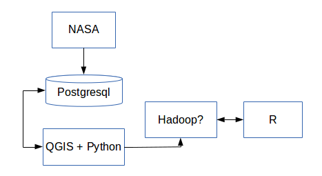

Luces de la ciudad
================================================================================
type:sub-section

Proponentes: Andrea Fernández y Adolfo De Unánue


Descripción
================================================================================

- Hay muchas bases de datos geoespaciales que incluyen densidad poblacional, 
crecimiento, pobreza,impactos ambientales, etc.
- Y la NASA tiene además las bases de datos relacionadas con luminosidad del mundo a nivel nocturno.
- Existen muchas teorías sobre si estas luces son un *proxy* para pobreza o subdesarrollo.
¿Será cierto?

Objetivo
================================================================================

- Obtener los datos espaciales y hacer el análisis necesario para responder preguntas como la recién mencionada.

- Otras preguntas interesantes son si hay correlación con violencia en algunas zonas, eventos, cambio climático, consumo de recursos, etc.


Objetivo acotado
----------------

Determinar si existe una relacion entre las luces de la ciudad e indicadores de pobreza en Mexico.

Tópicos
================================================================================

- Análisis geoespacial
- Impacto Ambiental
- Minería de datos

Estructura de las bases de datos
================================================================================

## Bases de luminosidad de NOAA

[National geophysical data center](http://ngdc.noaa.gov/eog/download.html "NOAA Data Download")

###VIIRS
1. [VIIRS Luces nocturnas-2012 (dos meses, global)](http://ngdc.noaa.gov/eog/viirs/download_viirs_ntl.html)
..* Este es el primer compilado que existe para la serie de datos nueva y con mayor resolucion. El compuesto se genera utilizando la banda de dia y noche de VIIRS (DNB) para datos recolectados en noches sin luz de luna. 
..* Se utilizan las observaciones para 2012/4/18-26 and 2012/10/11-23. La base excluye nubes mas no las detecciones de luz asociadas a fuegos, quema de gases, volcanes y la aurora (ademas de background noise). Es posible encontrar luz reflejada por superficies brillantes (lagos o lugares con nieve). 
..* La base en DNB ~9 GB  descomprimida y 638 MB comprimida.
2. [VIIRS Luces nocturnas-2012 (dos meses, global)](http://ngdc.noaa.gov/eog/viirs/download_viirs_monthly.html)
..* Compuestos con mas o menos las mismas caracteristicas que (1) pero para abril y octubre de 2012 y enero de 2013.
..* Descomprimidas por mes ~ 8 GB, comprimidas ~500 MB

###DMPS/OLS
[Version 4 de la serie de luces nocturnas](http://ngdc.noaa.gov/eog/dmsp/downloadV4composites.html "DMPS-OLS nighttime lights time series")

1. Promedios de luz visible, luces estables y coberturas sin nubes (1992-2012).[Mas informacion](http://ngdc.noaa.gov/eog/gcv4_readme.txt)
..*33 datasets, ~300 MB comprimidos y ~3 GB descomprimidos
..*cada set incluye el promedio visible en bruto, el promedio limpiado por cobertura de nubes, los datos que se obtuvieron sin nubes.
2. Promedio de luz x Pct
..* 33 datasets, ~500-800 MB comprimidos y ~3 GB descomprimidos 
..* Este producto se deriva del numero digital promedio de la banda visible (DN) de las detecciones de luces sin nubes multiplicado por la frecuencia de la deteccion de luz. La inclusion del porcentage de frecuencias de deteccion normaliza los DN's por variaciones en la persistencia de luz (i.e. el valor de una luz que es detectada solamente la mitad del tiempo se ve reducida por un 50%). Esta serie contiene las detecciones por fuegos y ruido de fondo.


Arquitectura
============



Código para obneter censo económico INEGI
============
```{bash}
#! /bin/bash
# Installar innoextract http://constexpr.org/innoextract/
# sudo add-apt-repository ppa:arx/release
# sudo apt-get update
# sudo apt-get install innoextract
# chmod +x download-census-shp.sh
# En mac instalar tambien rename 'brew install rename', 
# Esto hace un script shps con todos los shapefiles

 
# Para hacer compatibles las coordenadas
PROJECCION="+proj=longlat +ellps=WGS84 +no_defs +towgs84=0,0,0"
WGET="wget -w 5 --random-wait --tries=10 "
 
declare -a files=("ageb_urb" "eje_vial" "estatal" "loc_rur" "loc_urb"
    "manzanas" "municipal" "servicios_a" "servicios_l" "servicios_p")
 
declare -a estados=("ags" "bc" "bcs" "camp" "coah" "col" "chis" "chih" 
    "df" "dgo" "gto" "gro" "hgo" "jal" "mex" "mich" "mor" "nay" "nl" "oax" 
    "pue" "qro" "qroo" "slp" "sin" "son" "tab" "tamps" "tlax" "ver" "yuc" 
    "zac");
 

```
Código para obneter censo económico INEGI
============
```{bash}

# Con gdal se hace la conversion de coordenadas (tambien installar eso)
# tambien tener cuidado con el encoding
function reproject {
  for i in "${files[@]}"
  do
    ./ogr2ogr.py $1/$2_$i.shp "$1"/$i.shp -t_srs "$PROJECCION"
    rm "$1"/$i*
  done
  # rename
  cd $1/tablas
  rename "s/^cpv2010/$2_cpv2010/" cpv2010*
  rm -rf cpv2010*
  cd ../../..
}
```
Código para obneter censo económico INEGI
============
```{bash}
 
for i in {1..32}
do
   if [ $i -lt 10 ]
   then
     FILENUM="0$i"
   else
     FILENUM="$i"
   fi
   $WGET "http://www.inegi.org.mx/sistemas/consulta_resultados/scince2010.aspx?_file=/sistemas/consulta_resultados/scince2010/Scince2010_$FILENUM.exe&idusr=80085" -O ${estados[$i-1]}_scince.exe
   innoextract --lowercase --silent ${estados[$i-1]}_scince.exe 
   mkdir -p shps/${estados[$i-1]}
   cp -r app/$FILENUM/* shps/${estados[$i-1]}
   rm -rf app
   rm -rf tmp
   rm -rf ${estdos[$i - 1]}_scince.exe 
   reproject shps/${estados[$i - 1]} ${estados[$i - 1]}
   sleep 20
done
```


Plan de trabajo
===============
######Marzo 15
1. Adaptación del codigo de INEGI presentado para años anteriores del censo económico. Solucionando posibles complicaciones.
..* Comparacion
..* Cambios de metodología
..* Distintas variables


####Marzo 30
1. Adaptación del codigo presentado en [Night Lights in and ArcGIS: A brief guide](http://economics.mit.edu/files/8945) para qgis (con python). La limpieza será únicamente para los datos de México e incluye.
..* Conversion
..* Reclasificacion
..* Promedio (para los anos en que los datos fueron tomados por mas de un satelite)
..* Limpieza de bases por efectos de gases

2. Limpieza de datos economicos y extraccion de datos censales.
3. Proyección de los datos de luces a la unidad de análisis elegida de acuerdo a el nivel de desagregación que se tenga de los datos económicos (manzana, ageb, municipio)


####Abril 15
Se utilizara el censo economico a nivel municipal (a nivel manzana, si se puede conseguir) para determinar la relacion entre variables socioeconomicas en Mexico.
Asimismo, se utilizara el censo de poblacion y vivienda para buscar patrones entre las luces e indices de marginacion.

Resultados preliminares y analisis descriptivo


Bibliografia
================================================================================

- Chen and Nordhaus, "Using luminosity data as a proxy for economic statistics," *PNAS*  Vol. 108 No. 21, DOI:1017031108 [Link](http://www.pnas.org/content/108/21/8589.full#ref-13)
- Dell, Melissa "GIS Analysis for Applied Economists" Department of Economics, Massachusetts Institute of Technology, [Programming for economists](http://scholar.harvard.edu/files/dell/files/090110combined_gis_notes.pdf) (2009)
- Doll, "Thematic Guide to Night-time Light Remote Sensing and its Applications" CIESIN Thematic Guide (2008). [Link](http://wwwgateway.ciesin.org/binaries/web/sedac/thematic-guides/ciesin_nl_tg.pdf)
- Elvidge, Sutton, Ghosh, Tuttle, Baugh, Bhaduri, Bright, "A global poverty map derived from satellite data," *Computers and geosciences* 35(2009) 
- Henderson, Storeygard, Weil, "A Bright idea for Measuring Economic Growth," *American Economic Review* Vol. 101 No. 3 (2011): 194-199
- Lowe, Matt "Night Lights and ArcGIS: A Brief Guide" [Online version](http://economics.mit.edu/files/8945) (2014)
- Xi, Huimin, Xiaoling and Chang "Potential of NPP-VIIRS Nighttime Light Imagery for Modeling the Regional Economy of China" *Remote Sensing of Environment* 5(2013): 3057-3081. doi: 10.3390/rs5063057
- Zhang, Q., Seto, K. C. "Mapping urbanization dynamics at regional and global scales using multi-temporal DMSP/OLS nighttime light data." *Remote Sensing of Environment* 115.9 (2011): 2320-2329. DOI: 10.1016/j.rse.2011.04.032
- Zhang, Q., Schaaf, C., Seto, K. C. "The Vegetation Adjusted NTL Urban Index: A new approach to reduce saturation and increase variation in nighttime luminosity." *Remote Sensing of Environment* 129.1 (2013): 32-41. DOI: 10.1016/j.rse.2012.10.022
- Zhang, Q., Seto, K. C. "Mapping urbanization dynamics at regional and global scales using multi-temporal DMSP/OLS nighttime light data." *Remote Sensing of Environment* 115.9 (2011): 2320-2329. DOI: 10.1016/j.rse.2011.04.032
- http://www.diegovalle.net