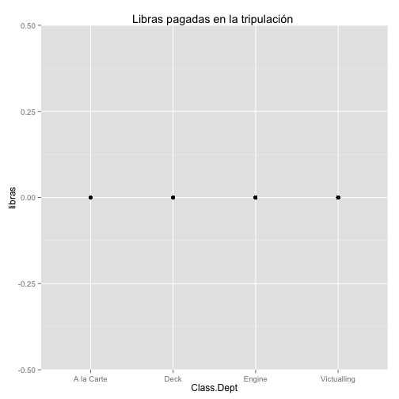
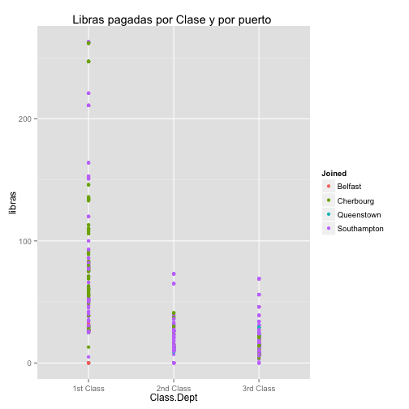
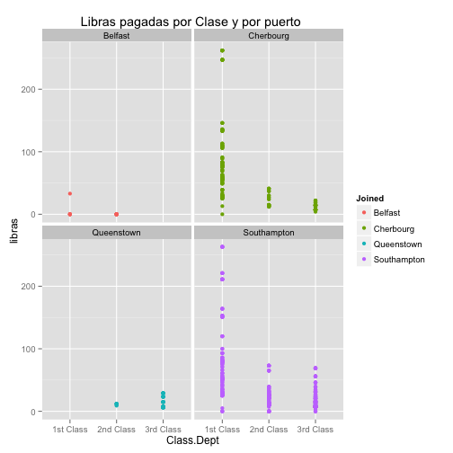
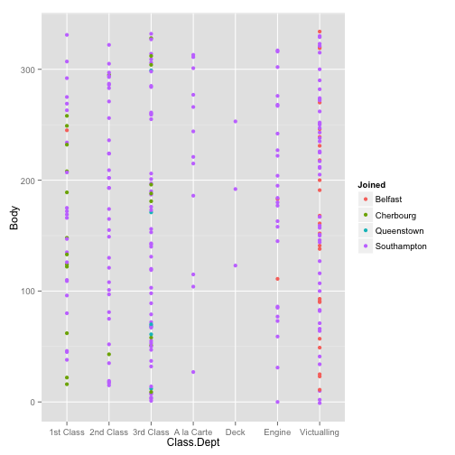
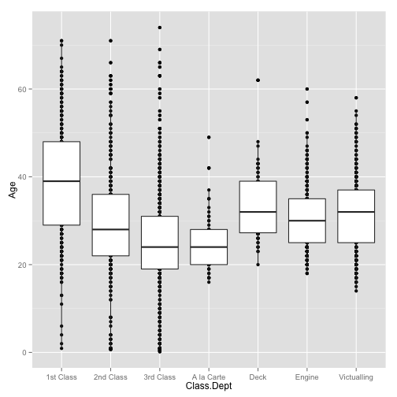
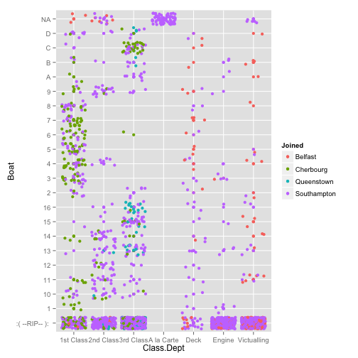
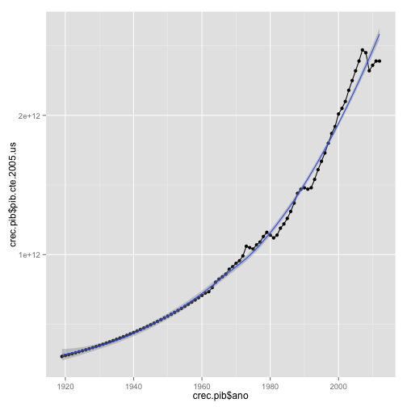
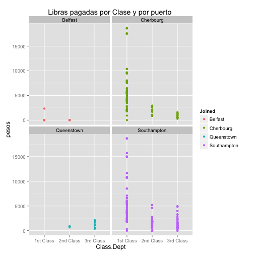
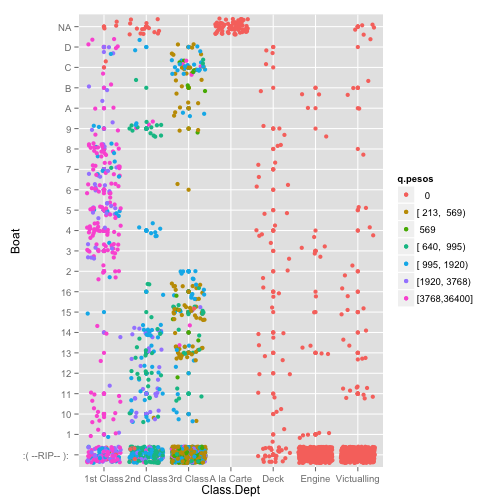

Carlos Petricioli
========================================================
author: Carlos Petricioli
date: 18 de febrero de 2014

1. Lectura de Datos
========================================================

Pasos para juntar las bases del titanic.

1. Primero genero una lista con los archivos a juntar.


```r
lista.datos <- lapply( dir('data/', pattern="csv"),
                       function(archivo){
 read.table(file=paste('data/',archivo,sep=''), 
            header=TRUE, sep="|", dec=".", 
                         as.is=TRUE, comment.char="#",quote="\"")  })
```


========================================================

Un poco de limpieza


```r
#hay que quitar la base sobre la gente que no se subió
discharged.crew <- lista.datos[[2]]
lista.datos[[2]] <- NULL
#hay que quitar la base sobre titanic 3
titanic.3 <- lista.datos[[10]]
lista.datos[[10]] <- NULL
#limpio columnas adicionales
for(i in 1:length(lista.datos)) { 
  lista.datos[[i]] <- lista.datos[[i]][,1:11] 
  print(names(lista.datos[[i]])) }
```

```
 [1] "Name"       "Age"        "Class.Dept" "Ticket"     "Fare"      
 [6] "Group"      "Ship"       "Joined"     "Job"        "Boat"      
[11] "Body"      
 [1] "Name"       "Age"        "Class.Dept" "Ticket"     "Fare"      
 [6] "Group"      "Ship"       "Joined"     "Job"        "Boat"      
[11] "Body"      
 [1] "Name"       "Age"        "Class.Dept" "Ticket"     "Fare"      
 [6] "Group"      "Ship"       "Joined"     "Job"        "Boat"      
[11] "Body"      
 [1] "Name"       "Age"        "Class.Dept" "Ticket"     "Fare"      
 [6] "Group"      "Ship"       "Joined"     "Job"        "Boat"      
[11] "Body"      
 [1] "Name"       "Age"        "Class.Dept" "Ticket"     "Fare"      
 [6] "Group"      "Ship"       "Joined"     "Job"        "Boat"      
[11] "Body"      
 [1] "Name"       "Age"        "Class.Dept" "Ticket"     "Fare"      
 [6] "Group"      "Ship"       "Joined"     "Job"        "Boat"      
[11] "Body"      
 [1] "Name"       "Age"        "Class.Dept" "Ticket"     "Fare"      
 [6] "Group"      "Ship"       "Joined"     "Job"        "Boat"      
[11] "Body"      
 [1] "Name"       "Age"        "Class.Dept" "Ticket"     "Fare"      
 [6] "Group"      "Ship"       "Joined"     "Job"        "Boat"      
[11] "Body"      
 [1] "Name"       "Age"        "Class.Dept" "Ticket"     "Fare"      
 [6] "Group"      "Ship"       "Joined"     "Job"        "Boat"      
[11] "Body"      
 [1] "Name"       "Age"        "Class.Dept" "Ticket"     "Fare"      
 [6] "Group"      "Ship"       "Joined"     "Job"        "Boat"      
[11] "Body"      
```

========================================================
2. Junto en un mismo archivo y genero el *.psv*

```r
titanic.completo <- Reduce(function(x,y) {rbind(x,y)}, lista.datos)
save(titanic.completo,file='titanic.completo.Rdata')
write.table(titanic.completo,file='titanic-complete.psv',sep='|' )
```


2. Descripción 
========================================================
Con la base completa se tiene que limpiar  todavía algunas variables.

```r
library(stringr)
load('titanic.completo.Rdata')
titanic <- titanic.completo
titanic$tripulacion <- rep(0,nrow(titanic))
titanic[which(titanic$Class.Dept %in% c('A la Carte', 'Deck','Engine' ,'Victualling') ),'tripulacion']  <- 1
#pasar edad a numerico
titanic$Age[which(str_detect(titanic$Age,'m') )]  <- 
  as.numeric(substr(x=titanic$Age[which(str_detect(titanic$Age,'m') )],
 start=1,stop=nchar(titanic$Age[which(str_detect(titanic$Age,'m') )] )-1))/12
titanic$Age <- as.numeric(titanic$Age)
```


========================================================


```r
#pasar fare a numerico
library(plyr)
x <- str_split( string=titanic$Fare, pattern=' ')
fares <- ldply(.data=x, function(arg){ data.frame(arg[1], arg[2] , arg[3]) }  )
names(fares) <- c('libras','s','d')
fares$libras  <- as.character(fares$libras)
fares$s <- as.character(fares$s)
fares$d <- as.character(fares$d)
fares$libras <- as.numeric( substr(x=fares$libras,
    start=2,stop=nchar(fares$libras) ) )
fares$s <- as.numeric(substr(x=fares$s, 
              start=1, stop=nchar(fares$s)-1 ) )
fares$d  <- as.numeric(substr(x=fares$d , 
                    start=1,stop=nchar(fares$d)-1 ))
fares$libras[is.na(fares$libras)] <- 0
fares$s[is.na(fares$s)] <- 0
fares$d[is.na(fares$d)] <- 0
titanic.1 <- cbind(titanic,fares)
```


========================================================
Esto contine la base de datos.


```r
summary(titanic.1)
```

```
     Name                Age         Class.Dept           Ticket         
 Length:2240        Min.   : 0.17   Length:2240        Length:2240       
 Class :character   1st Qu.:22.00   Class :character   Class :character  
 Mode  :character   Median :29.00   Mode  :character   Mode  :character  
                    Mean   :29.93                                        
                    3rd Qu.:36.00                                        
                    Max.   :74.00                                        
                    NA's   :19                                           
     Fare              Group             Ship            Joined         
 Length:2240        Length:2240        Mode:logical   Length:2240       
 Class :character   Class :character   NA's:2240      Class :character  
 Mode  :character   Mode  :character                  Mode  :character  
                                                                        
                                                                        
                                                                        
                                                                        
     Job                Boat                Body        tripulacion 
 Length:2240        Length:2240        Min.   : -1.0   Min.   :0.0  
 Class :character   Class :character   1st Qu.: 86.8   1st Qu.:0.0  
 Mode  :character   Mode  :character   Median :173.5   Median :0.0  
                                       Mean   :170.7   Mean   :0.4  
                                       3rd Qu.:252.8   3rd Qu.:1.0  
                                       Max.   :334.0   Max.   :1.0  
                                       NA's   :1994                 
     libras            s               d        
 Min.   :  0.0   Min.   : 0.00   Min.   : 0.00  
 1st Qu.:  0.0   1st Qu.: 0.00   1st Qu.: 0.00  
 Median :  7.0   Median : 0.00   Median : 0.00  
 Mean   : 19.2   Mean   : 4.89   Mean   : 1.68  
 3rd Qu.: 19.0   3rd Qu.:10.00   3rd Qu.: 1.00  
 Max.   :512.0   Max.   :19.00   Max.   :17.00  
                                                
```

========================================================

```r
#Estadísticas univariadas
summary(titanic.1$Age)
```

```
   Min. 1st Qu.  Median    Mean 3rd Qu.    Max.    NA's 
   0.17   22.00   29.00   29.90   36.00   74.00      19 
```

```r
table(titanic.1$Class.Dept)
```

```

              1st Class   2nd Class   3rd Class  A la Carte        Deck 
         10         327         299         708          69          66 
     Engine Victualling 
        325         436 
```

========================================================

```r
summary(fares)
```

```
     libras            s               d        
 Min.   :  0.0   Min.   : 0.00   Min.   : 0.00  
 1st Qu.:  0.0   1st Qu.: 0.00   1st Qu.: 0.00  
 Median :  7.0   Median : 0.00   Median : 0.00  
 Mean   : 19.2   Mean   : 4.89   Mean   : 1.68  
 3rd Qu.: 19.0   3rd Qu.:10.00   3rd Qu.: 1.00  
 Max.   :512.0   Max.   :19.00   Max.   :17.00  
```

```r
table(titanic.1$Group)
```

```

                    H&W Guarantee Group            Musician 
                985                  18                  16 
       Postal Clerk             Servant 
                 10                  43 
```

```r

table(titanic.1$Joined)
```

```

                            Belfast   Cherbourg  Queenstown Southampton 
         10           3         207         274         120        1626 
```

```r
table(titanic.1$Boat)
```

```

        1   10   11   12   13   14   15   16    2    3    4    5    6    7 
1557   12   31   37   19   52   38   43   30   17   32   38   34   23   26 
   8    9    A    B    C    D 
  27   30   13   16   42   22 
```


========================================================
Algunos más específicos.

 


========================================================

 

========================================================

 


3. Relaciones entre variables
========================================================
Para verificar los datos, se ve que  la tripulación no pagó.

 

========================================================

También se ve que los boletos de  las segunda y la tercera clase no eran muy distintos en precio
 

========================================================
Esta relación no es tan clara si separamos por puerto, solo sucede en South Hampton

 


========================================================
 


========================================================
 


========================================================
Esta es la mejor gráfica se puede ver que la primera clase sobrevivió mucho más, que los del Deck sobrivivieron practicamente todos.

 


5. En pesos
========================================================
De la base del Banco mundial. Estimado para 1919-1959.

 


Para transformar
========================================================


```r
library(Hmisc)
#formula para pasar a dlls de 2012 1 dollar = .6 poud
(crec.pib[2012-1919+1,2]/ crec.pib[1,2])
```

```
[1] 8.909
```

```r
titanic.limpio$pesos <- titanic.limpio$libras *13.3* .6*(crec.pib[2012-1919+1,2]/ crec.pib[1,2])
titanic.limpio$q.pesos <- cut2(titanic.limpio$pesos,g=10 )
```

========================================================
 

========================================================
 


R-Session
========================================================

```r
print(sessionInfo(), locale = FALSE)
```

```
R version 3.0.2 (2013-09-25)
Platform: x86_64-apple-darwin10.8.0 (64-bit)

attached base packages:
[1] splines   grid      stats     graphics  grDevices utils     datasets 
[8] methods   base     

other attached packages:
[1] Hmisc_3.14-0    Formula_1.1-1   survival_2.37-7 lattice_0.20-24
[5] ggplot2_0.9.3.1 plyr_1.8        stringr_0.6.2   knitr_1.5      

loaded via a namespace (and not attached):
 [1] cluster_1.14.4      colorspace_1.2-4    dichromat_2.0-0    
 [4] digest_0.6.4        evaluate_0.5.1      formatR_0.10       
 [7] gtable_0.1.2        labeling_0.2        latticeExtra_0.6-26
[10] MASS_7.3-29         munsell_0.4.2       proto_0.3-10       
[13] RColorBrewer_1.0-5  reshape2_1.2.2      scales_0.2.3       
[16] tools_3.0.2        
```

